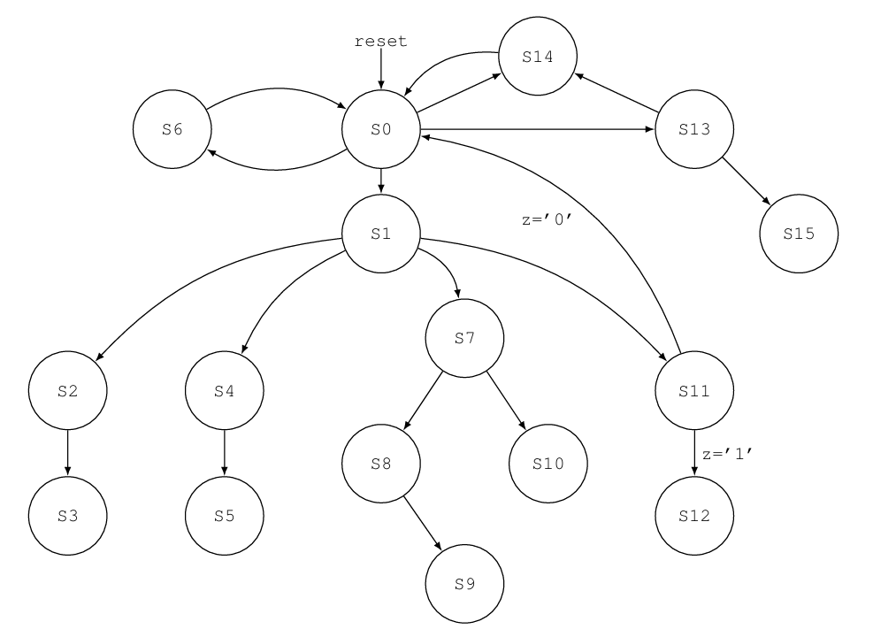

# IITB-CPU – EE224 Course Project

A simple 16-bit RISC-style **multicycle CPU** designed and implemented in **VHDL** as part of the **EE224: Digital Systems** course at **IIT Bombay**, taught by **Prof. Virendra Singh**.

  

## Project Overview

* **IITB-CPU** is a teaching-oriented 16-bit processor with 8 general-purpose registers.
* Follows a custom **instruction set architecture (ISA)**.
* Implements **point-to-point communication**.
* Written entirely in **VHDL** for FPGA-based simulation/synthesis.

## 📁 Repository Structure

* `src/` – VHDL source files  
* `testbench/` – Testbenches for simulation  
* `docs/` – Instruction set and architecture details

## Course

**EE224: Digital Systems**  
Department of Electrical Engineering, IIT Bombay  
Instructor: Prof. Virendra Singh

## 👥 Team Members

- **Yaswanth Ram Kumar** – 23B1277  
- **Sri Charan Raj K** – 23B1229  
- **Manidheep Reddy** – 23B1311  
- **Bhanu Prasanna** – 23B1291
